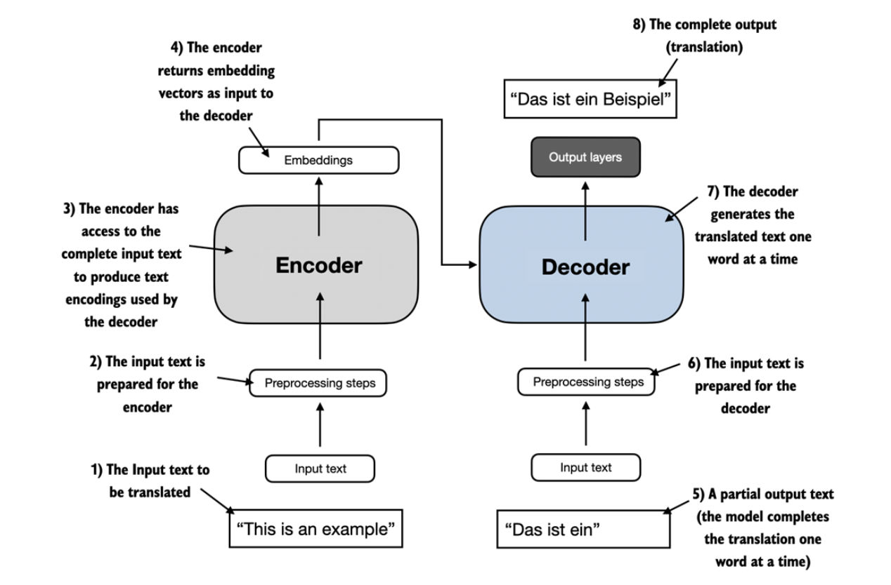
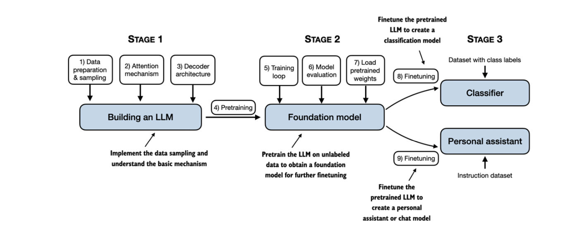
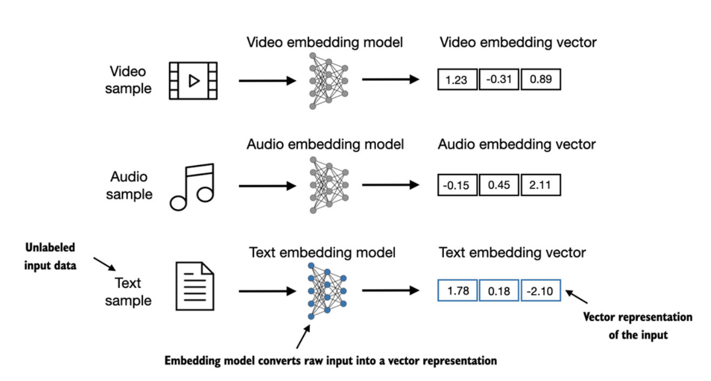
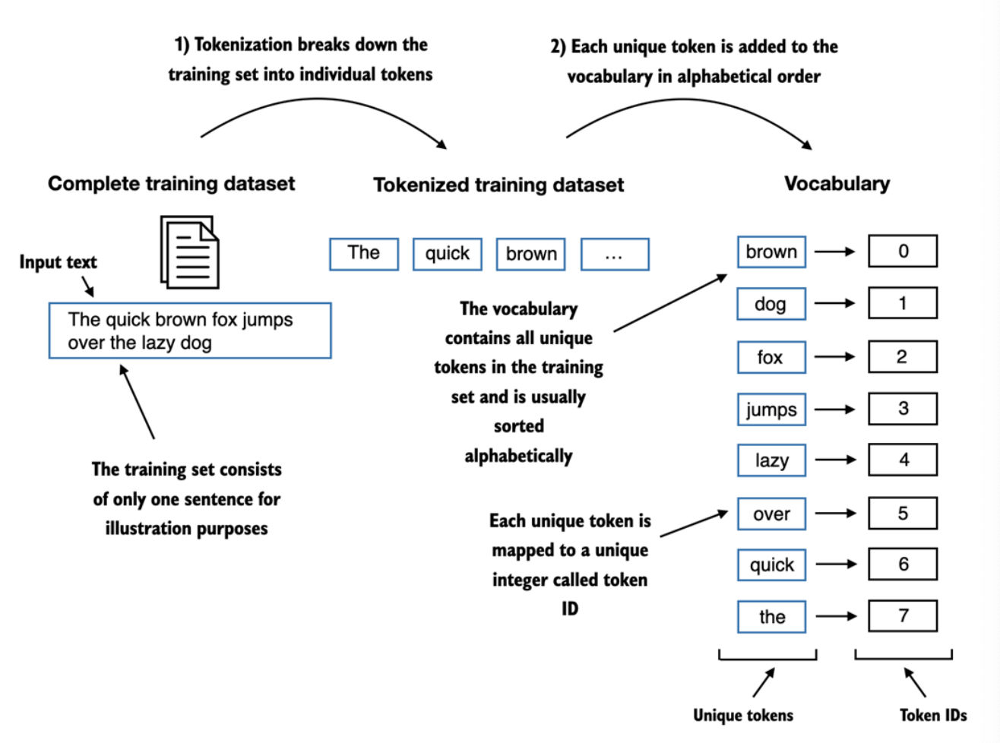

# Build LLM from scratch - Sebastian Raschka

  
## 1. Understanding Large Language **Models**

- Before LLM tasks such as text classification needed handcrafted features, but they underperform LLM for complex understanding tasks
- Deeplearning advancement, compute capacity and vast amount of data caused LLM to significantly improved performance
- earlier NLP models were task specific, and LLM allows general capabilities
- Significant improvement is due to Transformer architecture
### 1.1 What is an LLM?

- Large in LLM is both model's size and immense dataset on which its trained
- Most LLM works on next token prediction - its sensible as it harness the inherent sequential nature of language
- Transformer architecture allows model to play selective attention to different parts of the input while making predictions
- Since LLMs are capable of generating text --> generative AI
- ML --> DL --> GENAI --> LLM
### 1.3 stages of building LLM
- Why to build LLM?
	- Understand better, learn its limitations and strength
	- Learn more about how to finetune it better for your given task
- Task Specific LLM outperforms general purpose LLM

- Stages
- Pre- training
	- Unsupervised, on large text data corpus
	- next token prediction
	- Text completion
- Instruction fine tuning
	- Training on task specific
	- finetuning for classification task

### 1.4 Using LLM for different tasks

- Encoder - Decoder framework
- Attention is all you need -2017 paper (encoder, decoder framework)
- Variants of Transformers - BERT(Encoder only), GPT (Decoder only)
- BERT- classification task. Twitter uses bert to detect toxic content
- GPT - taxt completion, zero shot and few shot learning

### 1.6 Closer look at GPT architecture
- GPT 3 - scaled up version of this model (GPT) has more parameter, more data
- Chat-gpt - gpt 3.5 turbo = GPT 3 + instruct tuning (RLHF)

- Next token prediction is - ssl - self supervised learning
- Emergent property - Decoder only models are essentially next token prediction, however as size and scale increased, it showed significant improvements in performance. 
	- Task like translation are encoder-decoder model envisioned for, decoder model can solve and do the same. 
- Natural consequence to get exposure to large data, and it taught model general language capabilities. 

## Chapter 2 Working with text data
### 2.1 Understanding word embeddings
language of neural networks is vectors, how to represent text as a vector?
At its core embedding is mapping - Conversion of any modality(text, image, video) of discrete objects to a continuous vector format(space)
- Using a specific NN layer, we can embed different data types
- [[_resources/Chapters/c75daddcf34fd9d7bb8201acd7fd2ef2_MD5.jpeg|Open: Pasted image 20240310234552.png]]
- 

- Different type of embeddings for text data
	- word embeddings, sentence/paragraph embeddings, 
- Word Embeddings (used specifically in training of GPT style LLM)
	- word2vec -earlier and most popular algorithm
		- Similar context words should appear closer in the latent space
	- We can chose 2 dim for viz purposes, however higher dimension embedddings can capture more nuanced relationship at expense of computational efficiency
	- You can train embeddings separately, however LLM produce theri own embeddings as part of the model training
		- Why? since its part of training of LLM it produces embeddings specific to task and data at the hand
- Embeddings size 
	- GPT 2 - 768
	- GPT 3 (12,288)
	- GPT 3.5-4 (100k)
	- GEMMA - 256k
## 2.2 Tokenizing text

- GPT style models dont directly put words into embedding models, they go through a necessary processed called tokenization first.
- Tokenization is the process of converting text into smaller units called tokens
- Tokens can be words, subwords, characters or even part of words
- 

Text --> tokens --> token ids

Working with tokenizer
- Removing whitespace
	- Depends on use case, it can help in memory and compute req
	- However, it can be useful for coding task, which are sensitive to whitespace, indentation and spacing.
## 2.3 Converting tokens into token IDs

TO convert tokenize text corpus to token Ids, we need to build vocabulary first.
Vocabulary - Conversion of each unique work to special character

How to handle text or characters not seen by tokenizer???

## 2.4 Adding Special context tokens
- 2 new tokens
	- **<|endoftext|>** -Added as while training you can have 2 different data source concatenated into single batch. This token can help LLM understand that text sources are unrealted
	- **<|unk|>** - Assigns to new unseen tokens
- Researchers uses other special tokens also
	- **\[BOS]** - Beginning of sequence - start of text
	- **\[EOS]** - End of sequence - end of text equivalent
	- **\[PAD]** - Padding - shorter text extended with pad sequence when we work with varying length inputs

## 2.5 Byte Pair encoding
GPT style models dont use <|unk|> token as part of their tokenizer scheme
as we have seen in the code, it can lead to loss of information when trying to decode
Instead we can use BPE

### How does BPE handles the unknown word?
- It breaks down the unknown word to its smaller subword units or even individual characters, or byte pair representation of word -- that enables it to handle out-of-vocabulary **words**

### How to train BPE for given text corpus?
- BPE algorithm is basically starts as individual characters and iteratively combines the character combinations that frequently occur together into subwords. 
- The merges are determined by a frequency cutoff

## 2.6 Data sampling with sliding window
