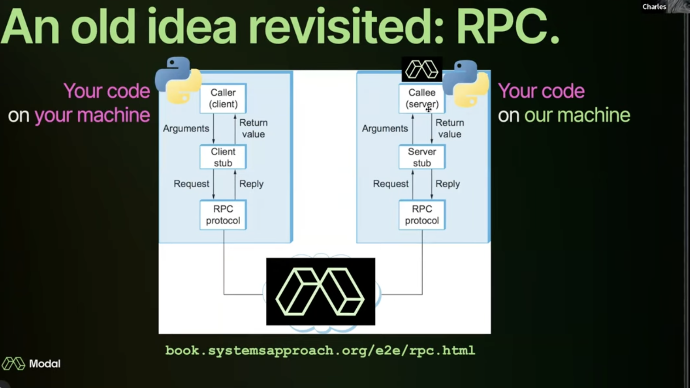

# modal labs

Scalable serverlss microservices as a code
Run any code remotely within seconds
attach gpu with single line code

How does that work?

- Modal takes your code and puts it in a container and executes it on cloud
  
Common components in a system

- Store
- Compute
- I/O

Pythonic way of doing above things

- Dict, queues, volumes, mounts (Store)
  - A form of storage but used distributed way
  - Job queues, datasets, weights (read heavvy)
  - Pricing - roughly same as s3
- Function, crons, GPUs
- WebEndpoints/ webservers (I/O)
  - FastAPI, Flask(wsgi)
  - async server

Python func is a unit of work.
DataBases

- OLTP (sqlite)
- OLAP (duckdb) (read heavy use case)

Rpc - Remote Procedure Call
- gRPC (google)


## Custom Containers[Docs](https://modal.com/docs/guide/custom-container)

Envirormments are defined within container
Customizing that container in modal

- ```pip install``` ( pip_install)
- ```custom Dockerfile```
- ```apt-get install``` (run_commands)(apt_install)
- ```mamba install``` (micromamba_install)

typical flow is chaining

```python
from modal import Image

image = (
    Image.debian_slim(python_version="3.10")
    .apt_install("git")
    .pip_install("torch==2.2.1")
    .env({"HALT_AND_CATCH_FIRE": 0})
    .run_commands("git clone https://github.com/modal-labs/agi && echo 'ready to go!'")
)
```

```python
from model import Image
import modal

def download_models():
    import diffusers

    pipe = diffusers.StableDiffusionPipeline.from_pretrained(
        model_id, use_auth_token=os.environ["HF_TOKEN"]
    )
    pipe.save_pretrained("/model")

datascience_image = (
    Image.debian_slim(python_version="3.10")
    .apt_install("git")
    .pip_install("pandas", "numpy", "scikit-learn")
    .micromamba_install("pymc==5.10.4", "numpyro==0.13.2", channels=["conda-forge"])
    .pip_install("uv")
    .run_commands("uv pip install --system --compile-bytecode torch") ##this compile 
    .run_commands("curl -O https://raw.githubusercontent.com/opencv/opencv/master/data/haarcascades/haarcascade_frontalcatface.xml")
    .run_function(download_models, secrets=[Secret.from_name("huggingface-secret")])
    .pip_install("bitsandbytes", gpu="H100")
    .entrypoint(["/usr/bin/my_entrypoint.sh"])
    .pip_install("slack-sdk", force_build=True) # force build the layer
    .env({"HF_HUB_ENABLE_HF_TRANSFER": "1"})
)

# or dierectly use prebuild image
sklearn_image = Image.from_registry("huanjason/scikit-learn")
# prebuilt image where python is not installed
image1 = Image.from_registry("ubuntu:22.04", add_python="3.11")
# image from aws ecr (https://modal.com/docs/guide/private-registries)
aws_secret = Secret.from_name("my-aws-secret")
image = (
    Image.from_aws_ecr(
        "000000000000.dkr.ecr.us-east-1.amazonaws.com/my-private-registry:latest",
        secret=aws_secret,
    )
)
# image from dockerfile
dockerfile_image = Image.from_dockerfile("Dockerfile")


@app.function(image=datascience_image,gpu='any') 
@app.function(gpu=modal.gpu.H100(count=8))
@app.function(gpu="H100:8")
@app.function(cpu=8.0,memory=32768,mem_request=32768, mem_limit=65148,concurrency_limit=5)
@app.function(schedule=modal.Cron("* * * * *"))
# modal jobs are 128 mb and 0.1 cpu by default
def some_func():
    import pandas as pd
    import numpy as np
    import sklearn
    df = pd.DataFrame(np.random.randn(100, 4), columns=list('ABCD'))
```

## Scaling and Monitoring

use function.map to run multiple functions in parallel
or use function.starmap to run multiple functions in parallel with multiple arguments
```python
import modal

app = modal.App()


@app.function()
def evaluate_model(x):
    ...


@app.local_entrypoint()
def main():
    inputs = list(range(100))
    for result in evaluate_model.map(inputs, return_exceptions=True):  # runs many inputs in parallel
    assert list(my_func.starmap([(1, 2), (3, 4)])) == [3, 7]
        ...
```

## dict, queues

Modal dicts 
- size limited to 10gb
- can be used to store weights, datasets, job queues
- serilized using cloudpickle

Modal Queues
- Distributed queue like object
- FIFO
- contain 10000 partitions, with each 5000 items. each item can be 256kb

```python
from modal import Dict, Queue
my_dict = Dict.from_name("my-persisted-dict", create_if_missing=True)
my_queue = Queue.from_name("my-persisted-queue", create_if_missing=True)

@app.local_entrypoint()
def main():
    my_queue.put("some value")
    my_queue.put(123)

    assert my_queue.get() == "some value"
    assert my_queue.get() == 123

    my_queue.put(0)
    my_queue.put(1, partition_key="foo")
    my_queue.put(2, partition_key="bar")

    # Default and "foo" partition are ignored by the get operation.
    assert my_queue.get(partition_key="bar") == 2

    # Set custom 10s expiration time on "foo" partition.
    my_queue.put(3, partition_key="foo", partition_ttl=10)

    # (beta feature) Iterate through items in place (read immutably)
    my_queue.put(1)
    assert [v for v in my_queue.iterate()] == [0, 1]

# async version using aio
@app.local_entrypoint() # this is an entry point to start the services
async def main():
    await my_queue.put.aio(100)
    assert await my_queue.get.aio() == 100

    await my_dict.put.aio("hello", 400)
    assert await my_dict.get.aio("hello") == 400
```

## Job Processing

First deploy job processing function using ```model deploy```
subit job using ```model.functions.Function.spawn()```
Polling for job results using ```model.function.FunctionCall.get()```


### Fast API Server use example

```python
import fastapi
from model import App, asgi_app
from model.function import FunctionCall

app=App('Modalapp')
web_app = fastapi.FastAPI()

@app.function()
@asgi_app()
def my_function():
    return web_app

@web_app.post("/submit-job")
async def submit_job_endpoint(data):
    procoess_job = model.Function.lookup("my-job-queue", "process_job")
    call = process_job.spawn(data)
    return {"call_id":call.object_id}

@web_app.get("/job-status/{call_id}")
async def job_status_endpoint(call_id):
    call = FunctionCall.get(call_id)
    try:
        result = function_call.get(timeout=0)
    except TimeoutError:
        return fastapi.responses.JSONResponse(content="", status_code=202)

    return result
# deploy with 
# modal serve server_script.py
```


### Example app usage

```python
image = modal.Image.debian_slim().pip_install(...)
mount = modal.Mount.from_local_dir("./config", remote_path="/root/")
secret = modal.Secret.from_name("my-secret")
volume = modal.Volume.from_name("my-data",create_if_missing=True)
app = modal.App(image=image,
                 mounts=[mount],
                secrets=[secret], 
                volumes={"/mnt/data": volume})

# volume.persist() # to persist the volume changes
# volume.reload()  # Fetch latest changes from volume
```

```app.local_entrypoint()``` is a CLI entrypoint for a Modal App, then do ```modal run app_module.py```

# Some more examples

[TRTLLM](https://modal.com/docs/examples/trtllm_llama#calling-inference-from-python)
[FineTuning](https://modal.com/docs/examples/llm-finetuning)
[StreamlitApp](https://modal.com/docs/examples/serve_streamlit)
[Finetuning t5](https://modal.com/docs/examples/flan_t5_finetune)
[DataWearhouse](https://modal.com/docs/examples/dbt_duckdb)
